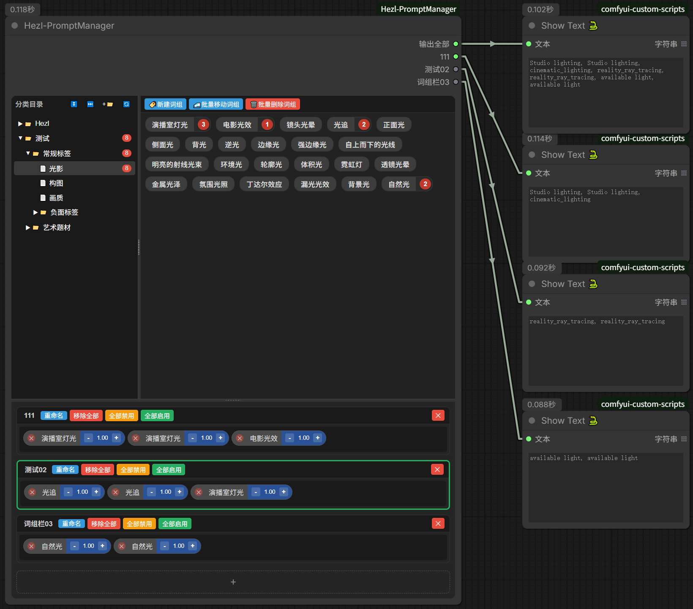

# ComfyUI_Hezl-PromptManager 
这是一个以文件夹层级分类,csv数据结构,来构筑的提示词插件  
  
## 更新  

### 260606
更新  
1. 新增多词组栏功能。每个词组栏都可单独输出字符串。词组栏命名也会使输出接口名称改变。  
2. 分类目录添加【展开】【收起】目录功能。  
3. 可多次添加同一个csv词组到下方词组栏了，并增加添加计数显示。点击计数红圈会删除词组栏里对应的词组。
4. 添加批量词组移动到其他csv文件里，批量词组删除.  

已知BUG：  
1. 拖拽词组功能与谷歌浏览器的一些拖拽插件产生冲突，导致词组无法拖拽.  
  
### 260510
1.修复【comfyui 0.2】更新后无法删除词组的BUG。  
2.删除【输出预览】板块。  
3.全面优化词组拖拽功能，拖拽词组后，排序不会乱了。  
4.修复节点宽高与插件不匹配问题。  

### 260317
1.将Comfyui节点自带的"prefix""suffix"去掉  
2.功能按钮全部转移到右键菜单,右键对应的选项可查看其功能  
3."词组显示"窗口改为胶囊式,更节省空间,在选中单个csv文件时可拖拽移到来改变csv文件里的词组排序  
4.各个窗口之间可以自由拖动边界,可改变窗口大小  
5.更改UI,使其更好使用,避免误触  


### 260308  
1.优化拖拽效果  
2.添加了按钮"新建csv",只能在选中文件夹状态下使用  
3.修复了"文件夹"和"csv"词组选中状态不一致  
4.修复重起Comfyui后不读取csv数据,使词组为不选中状态  
5.修复无法取消分类目录的选中状态  
  

## 使用  
  
### 功能
1. 以本地文件夹形式分类，读取csv  
2. 可勾选多个词组，并可在【预览模块】里移动顺序和权重调节  
3. 分类目录：点击文件夹会遍历此文件夹下的所有csv文件，想要单独读取就展开点击单个csv文件
4. 文件夹统计已勾选的词组，点击可取消勾选此文件夹已勾选的词组

### 已知与浏览器功能冲突   
1. 拖拽词组功能：与谷歌浏览器的一些拖拽插件产生冲突，导致词组无法拖拽.

### csv提示词数据  
数据路径 【```\Comfyui_Hezl-Prompt\csv】  

|title|content|
| ----------- | ----------- |
|标题 (1个单词)|1个单词|
|标题 (词组)|"单词01,单词02,···"|
  

