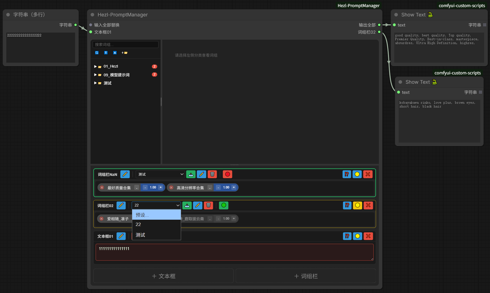
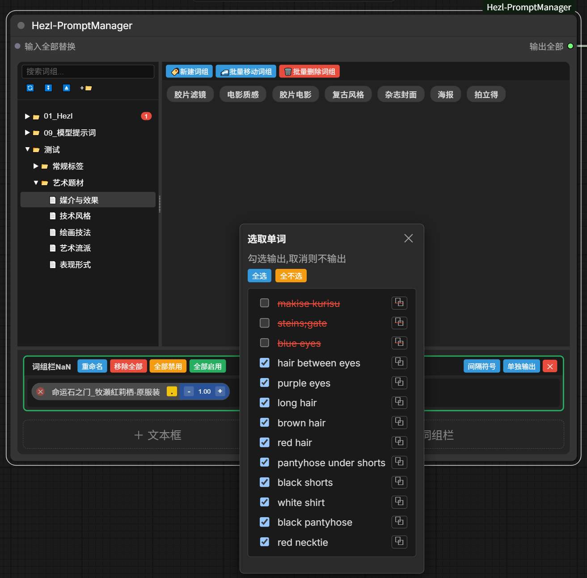
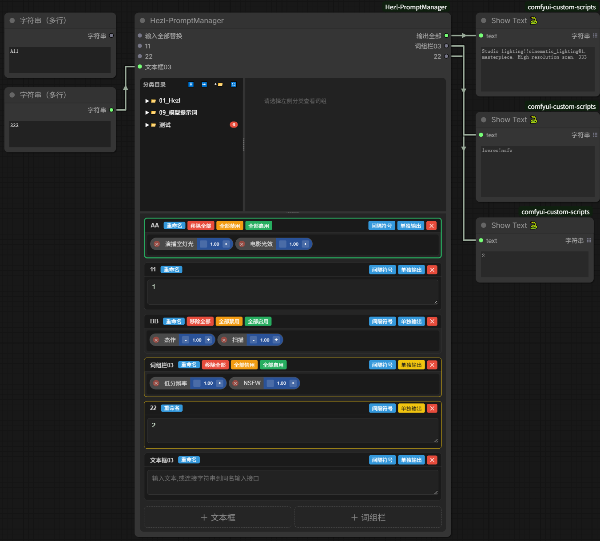
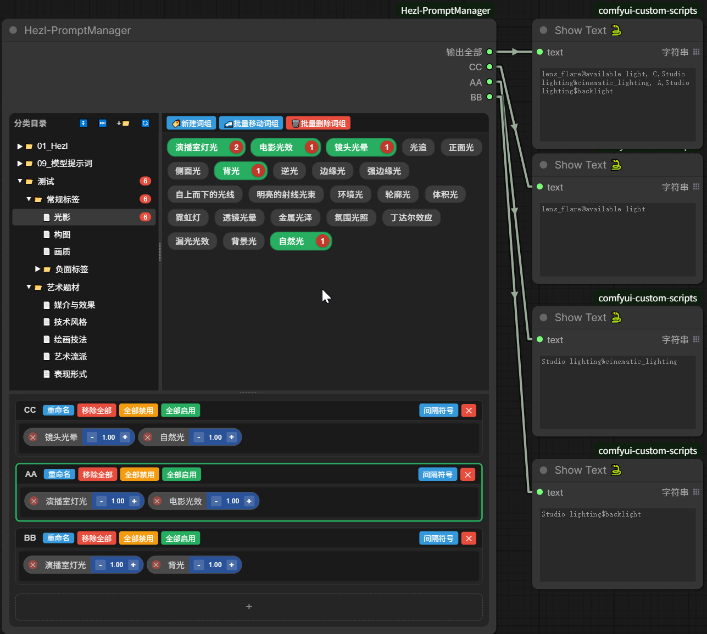
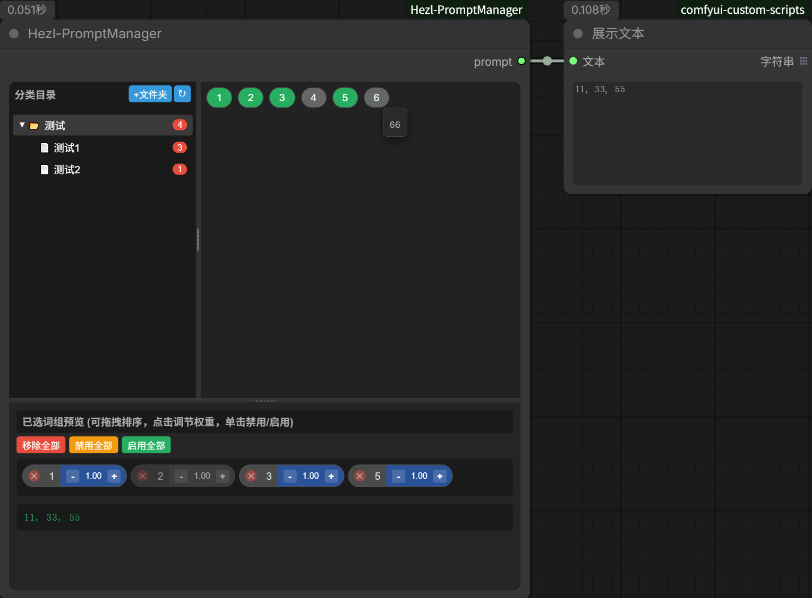
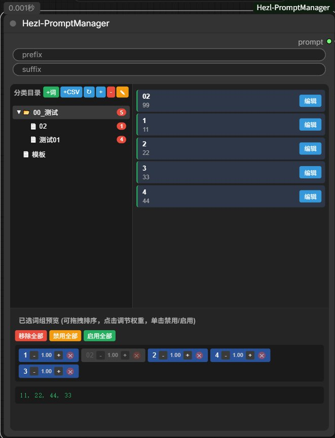

# ComfyUI\_Hezl-PromptManager
这是一个以文件夹层级分类,csv数据结构,来构筑的提示词插件

## 更新
每次更新后,请将原有的节点删除,并重新添加.
### 260802
  
1. 词组栏预设功能:词组栏头部新增预设下拉菜单 + 📥️保存 + ✏️重命名 + 🗑️删除;预设存为 `SavePreset/名称.json`,应用时替换当前词组栏内容(词组+权重+禁用+单词开关+间隔符号).
2. 头部按钮重排为图标布局:词组栏左 = 名称✏️ | 预设下拉📥️✏️🗑️ | 🟢/🔴启停开关(单个切换);右 = ⁉️间隔 + 🟡单独输出 + ❌️删除.文本框样式与词组栏统一(无预设).
3. 修复拖拽水平分隔条时上半部分强制跳到约 50% 的 BUG,改为始终跟随鼠标位置.
4. 预设下拉框:固定宽度(不再随预设名变化);选中预设后下拉框正确显示当前已选预设(此前会重置为占位项).
5. 取消水平分隔条对上半部分的最低高度限制,可拖动到任意位置;修复拖拽时分隔条相对鼠标偏移/无法跟随的问题:根因是 ComfyUI 画布缩放时 `getBoundingClientRect()`(视口坐标)与 `flex-basis`/`width`(CSS 像素)单位不一致,改用 `offsetHeight`/`offsetWidth` 并按缩放系数换算鼠标位移,任意缩放下均精确跟随鼠标(垂直分隔条同修).
6. 修复预设下拉框显示字符随操作闪变的 BUG:此前 `renderBars()` 每次都异步拉取 `/list_presets` 重建下拉选项,导致 toggle 全部启用/开关单词/拖拽等操作时下拉框先回到占位项"预设..."再恢复,看起来显示字符随点击变化.改为用 `_cachedPresets` 缓存在 `renderBars` 同步阶段渲染选项(含 `appliedPreset` 的 `selected`),异步请求仅在初始化与保存/重命名/删除预设时刷新缓存.
7. 文本框红色边框语义细分:文本框同名输入接口已连接(接收外部字符)时,**仅输入框(textarea)区域变红**,整个文本框 bar 边框不再变红;只有手动禁用文本框或"输入全部替换"接口连接时,整个文本框 bar 边框才变红.
8. 允许空词组栏保存预设(此前会提示"无内容可保存"并阻止);空预设应用时会清空目标词组栏,也可用于保存间隔符号配置.
9. 右键菜单新增"复制":在**右侧词组列表**的词组与**词组栏**的词组右键菜单中均新增"复制"项,点击复制该词组的 `content` 到剪贴板(优先 `navigator.clipboard`,不可用时回退 `execCommand`).

### 260723
  
1. 弹窗系统重构:所有词组操作弹窗(编辑/新建/添加/在⬅➡添词组)改为锚定到触发位置的小弹窗,不再居中全屏显示.
2. 单词选取功能:词组栏内每个词组新增"."按钮,点击后在该按钮下方弹出下拉列表,可按","拆分单词并实时开关输出.
   - 每个单词行新增复制按钮(⧉),点击即可复制该单词到剪贴板.
3. 小弹窗支持拖拽顶部移动位置.
4. 搜索功能优化:搜索按钮改为内联输入栏,输入即实时筛选(300ms防抖),Esc清空;去掉搜索弹窗.
   - 右侧词组列表中,符合搜索结果的词组显示1px黄色边框.
5. 目录树顶部改为两行布局:第一行为搜索输入栏,第二行为功能按钮(🔄⏬️⏏️+📁),左对齐,按钮行与目录树之间用横线分割.
6. 右键菜单文案更新:"在⬆位置添加新词组"→"在⬅添词组","在⬇位置添加新词组"→"在➡添词组".
7. 修复右键删除无法删除空标题词组的BUG.
8. "收起全部"按钮图标⏭️改为⏏️.

### 260619
1. 词组栏/文本框边框状态改为三色显示:
   - 绿色: 选中状态.
   - 黄色: 单独输出状态(未选中时1px,选中时2px).
   - 红色: 禁用状态(未选中时1px,选中时2px),优先级最高,覆盖绿/黄.
2. 文本框新增【禁用/启用】按钮,禁用后边框变红且内容不输出;启用后恢复.
3. 输入接口连接到同名文本框时,该文本框边框变红,效果等同于手动禁用.
4. "输入全部替换"接口连接时,所有词组栏和文本框边框都变红.
5. 词组栏内全部词组禁用时,词组栏边框变红;启用任意词组后红色消失;"禁用全部"按钮也会触发.
6. 新增词组搜索功能:
   - 左侧顶部添加🔍️搜索按钮,点击弹出输入窗口,支持确认/取消/清空.
   - 搜索范围覆盖所有CSV文件中的词组标题与内容.
   - 确认后左侧目录树只显示包含匹配词组的CSV文件及其父文件夹.
   - 右侧词组列表中,符合搜索结果的词组会显示1px黄色边框.

### 260617
1. 新增文本框功能,可接其他节点的字符串.
2. 新增单独输出功能,去除原来的每个词组栏都有单独的输出接口.
   - 开启单独输出后, "输出全部"接口会排除单独输出里的字符.
3. 新增输入接口,可接其他节点的字符串.接入时会替换掉此节点的全部字符.  



### 260606
更新
1. 新增多词组栏功能。
   - 每个词组栏都可单独输出字符串。
   - 词组栏命名也会使输出接口名称改变。
   - 可拖拽更改词组栏排序.
   - 增加自定义间隔符号功能，默认是逗。
   - 右键词组可定位到词组所在位置.
   - 最多支持10个词组栏。
2. 分类目录添加【展开】【收起】全部目录功能。右键可单独展开文件夹.
3. 可多次添加同一个csv词组到下方词组栏了，并增加添加计数显示。点击计数红圈会删除词组栏里对应的词组。
4. 添加批量词组移动到其他csv文件里，批量词组删除.

已知BUG：

1. 拖拽词组功能与谷歌浏览器的一些拖拽插件产生冲突，导致词组无法拖拽.



### 260510

1.修复【comfyui 0.2】更新后无法删除词组的BUG。\
2.删除【输出预览】板块。\
3.全面优化词组拖拽功能，拖拽词组后，排序不会乱了。\
4.修复节点宽高与插件不匹配问题。

### 260317

1.将Comfyui节点自带的"prefix""suffix"去掉\
2.功能按钮全部转移到右键菜单,右键对应的选项可查看其功能\
3."词组显示"窗口改为胶囊式,更节省空间,在选中单个csv文件时可拖拽移到来改变csv文件里的词组排序\
4.各个窗口之间可以自由拖动边界,可改变窗口大小\
5.更改UI,使其更好使用,避免误触\


### 260308

1.优化拖拽效果\
2.添加了按钮"新建csv",只能在选中文件夹状态下使用\
3.修复了"文件夹"和"csv"词组选中状态不一致\
4.修复重起Comfyui后不读取csv数据,使词组为不选中状态\
5.修复无法取消分类目录的选中状态\


## 使用

> 每次更新后,请将原有的节点删除,并重新添加,以保证新结构与节点输出端口同步.

### 节点概述

本节点以**本地文件夹层级分类 + CSV 数据结构**为基础,在节点内部提供一个完整的提示词管理工作台,可在节点内直接完成词组的浏览、勾选、权重调节、单词级开关、文本框拼接以及节点输入输出控制.

节点界面整体分为三大区域,区域之间通过可拖拽的分隔条调整大小:

```
┌─────────────────────────────────────────────┐
│  上半部分 (hezl-prompt-top)                    │
│ ┌──────────────┬──────────────────────────┐ │
│ │  左侧 目录树   │   右侧 词组列表            │ │
│ │  (sidebar)   │   (prompt-list)         │ │
│ └──────────────┴──────────────────────────┘ │
├──── 可拖拽水平分隔条 (splitter-horizontal) ────┤
│  下半部分 (hezl-prompt-bottom)                 │
│       词组栏 / 文本框 列表 (bars-container)     │
│       ＋ 文本框   ＋ 词组栏                     │
└─────────────────────────────────────────────┘
```

### 1. 左侧 — 分类目录树面板

管理本地 `csv` 文件夹结构,以树形展示文件夹与 CSV 文件.

**顶部两行布局**(按钮行与目录树之间有横线分割):
- 第一行:**搜索输入栏** — 输入关键词实时筛选(300ms 防抖),匹配词组的标题或内容;按 `Esc` 清空并恢复全部目录.
- 第二行:**功能按钮行**(左对齐)
  - `🔄` 刷新 — 重新读取磁盘目录结构.
  - `⏬️` 展开全部 — 展开所有文件夹.
  - `⏏️` 收起全部 — 收起所有文件夹.
  - `+📁` 根目录新建文件夹 — 在 `csv` 根目录下创建新文件夹.

**目录树交互**:
- 点击**文件夹**:遍历读取该文件夹下所有 CSV 文件的词组,右侧合并展示.
- 点击**CSV 文件**:仅读取该单个 CSV 文件.
- 文件夹右侧的**红色计数徽章**:统计该文件夹下已被勾选加入词组栏的词组数量;鼠标悬停变 `✕`,点击可**一键移除**该文件夹下所有已加入词组栏的词组.
- 文件夹可点击展开/收起;右键可单独展开/收起子文件夹.

### 2. 右侧 — 词组列表面板

展示当前选中分类下的所有词组,供勾选加入词组栏.

**工具栏**(仅在选中 CSV 文件时显示):
- `🏷️ 新建词组` — 在当前 CSV 末尾追加新词组(锚定小弹窗).
- `🚅 批量移动词组` — 将当前 CSV 中的词组批量移动到其他 CSV 文件.
- `🗑️ 批量删除词组` — 批量删除当前 CSV 中的词组.

**词组项(胶囊式)**:
- **标题** + **计数徽章**(显示该词组已被加入词组栏的次数)+ **编辑**按钮.
- 点击词组项:添加到当前选中的词组栏;再次点击或点击计数徽章可移除一个实例.
- 计数徽章悬停变 `-`,点击从词组栏移除一个该词组.
- `编辑`按钮:在按钮位置下拉出编辑小弹窗,可修改标题/内容.
- 选中 CSV 时可**拖拽**词组项以调整其在 CSV 内的排序.
- **搜索匹配**的词组会显示 1px 黄色边框,便于在结果中定位.
- 右键词组项:弹出右键菜单(见下文).

### 3. 下半部分 — 词组栏 / 文本框面板

节点输出的核心区域.每个条目(item)有两种类型:`词组栏(bar)` 与 `文本框(textbox)`,统一按顺序排列.底部提供 `＋ 文本框` 与 `＋ 词组栏` 两个添加按钮.

#### 3.1 词组栏 (Bar)

由左侧添加的词组组成的胶囊列表,可单独输出或参与"输出全部".

**头部操作按钮布局**(左 | 右):

- **左侧**:`名称 + ✏️重命名` `|` `预设下拉 + 📥️保存预设 + ✏️重命名预设 + 🗑️删除预设` `|` `🟢/🔴启停开关`
  - **名称**(如 `词组栏01`):双击可重命名;重命名会同步输出接口名称.
  - `✏️` 重命名词组栏.
  - **预设下拉菜单**:选择已有预设即应用到当前词组栏(替换内容).
  - `📥️` 保存预设 — 将当前词组栏内容(词组+权重+禁用+单词开关+间隔符号)存为预设.**空词组栏也可保存**(得到空预设,应用时会清空目标词组栏;也可用于保存间隔符号配置).
  - `✏️` 重命名预设 — 需先在下拉中选择一个预设.
  - `🗑️` 删除预设 — 需先在下拉中选择一个预设.
  - `🟢/🔴` 启停开关(单个切换按钮):全部启用时显示 `🔴`(点击全部禁用);存在禁用时显示 `🟢`(点击全部启用).
- **右侧**:`⁉️间隔符号` + `🟡单独输出` + `❌️删除该词组栏`
  - `⁉️` 间隔符号 — 设置"词组间间隔符号"与"与下一个词组栏间隔符号"(默认 `, `).
  - `🟡` 单独输出 — 开启后高亮,该词组栏从"输出全部"中排除,并生成一个独立的输出接口.
  - `❌️` 删除该词组栏.

**词组预览项**(胶囊式,可拖拽):
- **标题文本** + **权重控制**(`-` `值` `+`,步进 0.01) + **`.` 单词选取按钮** + `✕ 移除按钮`.
- 点击预览项主体:切换该词组的**禁用/启用**状态.
- 拖拽预览项:可在**同一词组栏内**或**跨词组栏**移动词组并保留权重/禁用/单词开关状态.
- 拖拽词组栏头部:可**调整词组栏之间的顺序**.

**权重输出规则**:权重非 1.0 时,输出会包裹为 `(内容:权重)` 格式.

#### 3.2 文本框 (Textbox)

可手动输入文本,或接收其他节点的字符串输入.头部按钮样式与词组栏统一(无预设).

**头部操作按钮布局**(左 | 右):

- **左侧**:`名称 + ✏️重命名` `|` `🟢/🔴启停开关`
  - 名称(如 `文本框01`):双击重命名.
  - `✏️` 重命名.
  - `🟢/🔴` 启停开关(单个切换按钮):启用时显示 `🔴`(点击禁用);禁用时显示 `🟢`(点击启用).
- **右侧**:`⁉️间隔符号` + `🟡单独输出` + `❌️删除`
  - `⁉️` 间隔符号 — 仅设置"与下一个词组栏间隔符号".
  - `🟡` 单独输出 — 同词组栏.
  - `❌️` 删除该文本框.

**输入优先级**:当同名输入接口连接了外部字符串时,**连接优先**于手动输入的文本.

#### 3.3 边框三色状态

词组栏/文本框的边框颜色反映其当前状态(优先级:**红 > 黄 > 绿**):

| 颜色 | 状态 | 默认 | 选中叠加 |
| --- | --- | --- | --- |
| 🟢 绿色 | 当前选中条目 | 1px | 2px |
| 🟡 黄色 | 开启"单独输出" | 1px | 2px |
| 🔴 红色 | 禁用状态(优先级最高,覆盖绿/黄) | 1px | 2px |

触发红色边框的情境:
1. 文本框手动禁用 → **整个文本框** bar 边框变红.
2. 文本框同名输入接口已连接外部字符串 → **仅文本框内的输入框(textarea)**变红,整个文本框 bar 不变红(表示"正在接收外部字符",而非禁用).
3. "输入全部替换"接口已连接(此时**所有**词组栏和文本框都变红).
4. 词组栏内**全部词组**均被禁用(空栏不红,启用任意词组后红色消失).

> 区分:文本框"接收外部字符"(同名输入已连接)时仅输入框区域变红;只有"手动禁用"或"输入全部替换"才会让整个文本框 bar 边框变红.

### 4. 单词选取功能

词组栏内每个词组预览项右侧的 **`.` 按钮**:

- 点击后在按钮**下方下拉**出单词列表(非全屏弹窗).
- 按 `,` 拆分词组内容为单词,自动去重并保留出现顺序.
- 每个单词行:**复选框**(勾选=输出,取消=不输出) + **单词文本** + **`⧉ 复制按钮`**(复制该单词到剪贴板).
- 顶部 `全选` / `全不选` 按钮.
- 实时生效,关闭弹窗即写回;已禁用单词不会出现在最终输出中.
- 若该词组已禁用部分单词,`.` 按钮会高亮提示"已禁用 N 个单词".

### 5. 弹窗系统

所有词组操作弹窗均采用轻量小弹窗(`hezl-popover`),不再居中全屏显示:

- **锚定位置**:在触发按钮(或右键坐标)附近弹出,自动避开屏幕边缘.
- **顶部可拖拽**:按住弹窗顶部标题栏可移动整个弹窗位置.
- **点击外部关闭**:点击弹窗外区域即关闭.
- **统一风格**:编辑词组 / 新建词组 / 添加词组 / 在⬅添词组 / 在➡添词组 / 单词选取 均使用此小弹窗.

少量复杂弹窗(如间隔符号设置、批量移动/删除、添加文件夹等)仍使用居中模态窗,但**居中位置以当前节点所在区域中心**为准,而非整个屏幕中心.

### 6. 右键菜单

根据右键目标不同,显示对应操作:

| 右键目标 | 菜单项 |
| --- | --- |
| 空白处 | 根目录新建文件夹 / 刷新 |
| 文件夹 | 展开子文件夹 / 收起子文件夹 / 添加子文件夹 / 新建CSV文件 / 重命名 / 删除 |
| CSV 文件 | 添加词组 / 移动到其他文件夹 / 重命名 / 删除 |
| 右侧词组项 | 复制 / 在⬅添词组 / 在➡添词组 / 编辑 / 删除 |
| 底部词组预览项 | 复制 / 编辑 / 定位到词组所在目录 / 启用 / 禁用 / 删除 |

> "复制"= 复制该词组的 `content` 到剪贴板.
> "编辑"(底部词组预览项)= 与右侧词组列表的"编辑"一致:弹出编辑小弹窗修改标题/内容,保存后写回 CSV 并同步更新所有词组栏中同名词组.

> "在⬅添词组"= 在当前词组**左侧**插入新词组;"在➡添词组"= 在**右侧**插入.

### 7. 节点输入 / 输出接口

#### 输入 (Inputs)
- **输入全部替换**(固定首位输入):连接外部 STRING 后,"输出全部"接口**只输出该外部字符串**,完全替换节点内容;同时所有词组栏/文本框边框变红.
- **文本框同名输入**:每个文本框会生成一个同名 STRING 输入接口;连接后**仅该文本框内的输入框(textarea)变红**(表示正在接收外部字符,外部字符串优先),整个文本框 bar 边框不变红;若再手动禁用该文本框,则整个文本框 bar 边框才变红.

#### 输出 (Outputs)
- **输出全部**(固定首位输出):按显示顺序拼接所有**未开启单独输出**的条目,条目之间使用前一条目的"与下一个词组栏间隔符号"连接;排除单独输出的内容.
- **单独输出 NN**:每个开启"单独输出"的条目(词组栏或文本框)生成一个独立输出接口,按显示顺序编号;重命名条目会同步更新接口名称,同名时自动追加序号避免冲突.

### 8. 搜索功能

- 左侧顶部**内联搜索输入栏**(输入即实时筛选,300ms 防抖,`Esc` 清空).
- 搜索范围覆盖所有 CSV 文件中的**词组标题与内容**.
- 搜索时左侧目录树**只显示包含匹配词组的 CSV 文件及其父文件夹**(精简树).
- 右侧词组列表中,匹配的词组显示 **1px 黄色边框**.
- 清空搜索输入即恢复完整目录树.

### 9. 词组栏预设

词组栏头部提供预设管理,用于快速保存/复用一整套词组配置.

- **存储位置**:插件根目录 `SavePreset/`,每个预设为一个 `名称.json` 文件.
- **预设内容**:词组栏的完整快照(词组列表、权重、禁用状态、单词开关、词组间/词组栏间间隔符号);不含词组栏名称.
- **预设下拉菜单**:选择预设即**应用到当前词组栏**(替换其内容),应用时会为每个词组重新生成 id 以避免冲突.
- `📥️` **保存预设**:弹出名称输入小窗,将当前词组栏内容存为预设(同名覆盖).
- `✏️` **重命名预设**:需先在下拉中选择一个预设,再输入新名.
- `🗑️` **删除预设**:需先在下拉中选择一个预设,确认后删除对应文件.
- 预设为**全局共享**:任一词组栏保存的预设,可被任意词组栏加载.
- 仅词组栏显示预设控件(文本框无词组,不显示预设).

### 已知与浏览器功能冲突

1. 拖拽词组功能:与谷歌浏览器的一些拖拽插件产生冲突,导致词组无法拖拽.

### CSV 提示词数据

数据路径:【`ComfyUI_Hezl-PromptManager/csv/`】

| title       | content             |
| ----------- | ------------------- |
| 标题 (1个单词) | `1个单词`             |
| 标题 (词组)   | `单词01,单词02,···`   |

- `title`:词组标题(建议简短,用于显示与检索).
- `content`:词组内容,多个单词以英文逗号 `,` 分隔(支持单词级开关拆分).
- 支持嵌套文件夹分类;右键可在文件夹内新建 CSV / 子文件夹.

