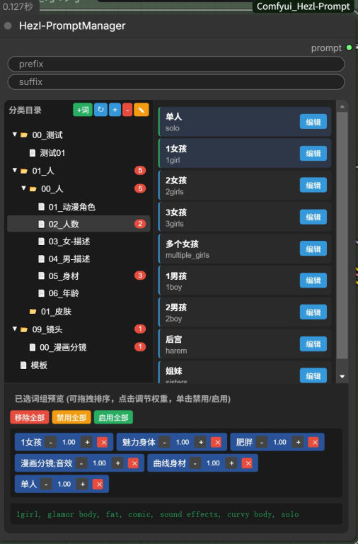

# ComfyUI_Hezl-PromptManager 
这是一个以文件夹层级分类,csv数据结构,来构筑的提示词插件  
  
## 更新  
### 260308  
<<<<<<< HEAD
1.优化拖拽效果  
2.添加了按钮"新建csv",只能在选中文件夹状态下使用  
3.修复了"文件夹"和"csv"词组选中状态不一致  
4.修复重起Comfyui后不读取csv数据,使词组为不选中状态  
5.修复无法取消分类目录的选中状态  
  

## 使用  
  
### 功能
1. 以本地文件夹形式分类，读取csv  
2. 可勾选多个词组，并可在【预览模块】里移动顺序和权重调节  
3. 分类目录：点击文件夹会遍历此文件夹下的所有csv文件，想要单独读取就展开点击单个csv文件
4. 文件夹统计已勾选的词组，点击可取消勾选此文件夹已勾选的词组

### csv提示词数据  
数据路径 【```\Comfyui_Hezl-Prompt\csv】  

|title|content|
| ----------- | ----------- |
|标题 (1个单词)|1个单词|
|标题 (词组)|"单词01,单词02,···"|
  

